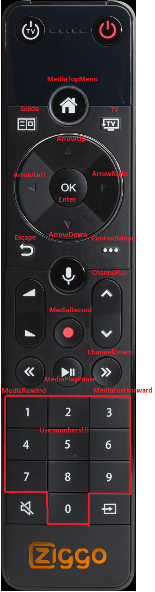

# Arris DCX960 Horizon Settop box (Ziggo, Telenet, Magenta, UPC, Virgin)

[](https://github.com/custom-components/hacs)
<br><a href="https://www.buymeacoffee.com/sholofly" target="_blank"></a>

## Description

A media player component for Home Assistant that creates a media player and a sensor for each Horizon EOS Settopbox in your account.

## Supported Countries and providers

| Country | Provider | Box name | Confirmed working
| --- | ----------- | --- | -----------|
| Netherlands | Ziggo | [Mediabox Next](https://www.ziggo.nl/televisie/mediaboxen/mediabox-next#ziggo-tv) | yes
| Austria | Magenta | [Entertain box 4K](https://www.magenta.at/entertain-box) | yes
| Switzerland | UPC Switzerland | [UPC TV Box](https://www.upc.ch/en/television/learn-about-tv/tv/) | yes
| Belgium | Telenet | [Telenet TV-Box](https://www2.telenet.be/nl/klantenservice/ontdek-de-telenet-tv-box/) | yes
| Great Britain | Virgin Media | [Virgin TV 360](https://www.virginmedia.com/shop/tv/virgin-tv-360) | yes
| Ireland | Virgin Media | [360 box](https://www.virginmedia.ie/virgintv360support/) | no (testers wanted!)


## Possible countries/providers
Want to find out if your box/provider can be added in the future? Please go to the [Horizon site in your country](https://www.horizon.tv). If the web interface looks familiar please contact me end lets figure that out.

Next countries do have that familiar web interface but I don't have enough info to be able to add them to the support list. 
| Country | Web app URL 
| --- | ----------- 
| Chech Republic | [Horizon TV](https://www.horizon.tv/cs_cz)
| Romania | [Horizon TV](https://www.horizon.tv/ro_ro)
| Slovakia | [Horizon TV](https://www.horizon.tv/sk_sk)
| Germany | [Unknown](https://www.horizon.tv/de_de) | no (testers wanted!)
| Poland | UPC PL | [Unknown](https://www.horizon.tv/pl_pl.html) | no (testers wanted!)
| Hungary | Vodafone Hungary | [Unknown](https://www.horizon.tv/hu_hu.html) | no (testers wanted!)


## BREAKING CHANGE!

The channel sensors are removed from version 0.12.0 of the component. To get a sensor for a channel please create the following template sensor for every box:

```yaml
sensor:
  - platform: template
    sensors:
      ziggo_beneden_channel:
        friendly_name: "Media player channel"
        value_template: "{{ state_attr('media_player.<your_settop_box_id>', 'channel') }}"
```

## Prerequisites

- The energy mode needs to be set to high, otherwise you are not able to switch the device on in the media player.

## HACS Installation

1. Make sure you've installed [HACS](https://hacs.xyz/docs/installation/prerequisites)
2. In the integrations tab, search for ZiggoNext.
3. Install the Integration.
4. Add ziggonext entry to configuration (see below)

## Manual installation

1. Open the directory (folder) for your HA configuration (where you find configuration.yaml).
2. If you do not have a custom_components directory (folder) there, you need to create it.
3. In the custom_components directory (folder) create a new folder called ziggonext.
4. Download all the files from the custom_components/ziggonext/ directory (folder) in this repository.
5. Place the files you downloaded in the new directory (folder) you created.
6. Add ziggonext entry to configuration (see below)
7. Restart Home Assistant

## Configuration (Example!)

```yaml
ziggonext:
  username: !secret settopbox_provider_username
  password: !secret settopbox_provider__password
  country_code: nl 
```

The id's for media_players and sensors are generated based on the name provided by your provider. You can adjust your box name in the settings on the website of your provider website.

### Parameters

| Parameter | Type | Required | Description
| --- | ----------- | --- | --- |
| username | string | yes | Your provider username |
| password | string | yes | Your Ziggo password |
| country_code | string | no (default 'nl')| Your country code. Currently supported: nl, ch, at, be-nl, be-fr, gb, ie**, pl**, hu** |
| omit_channel_quality | boolean | no (default: False)| Set to True if you want the postfix HD removed from yout channel names
** Testers needed!


## Service to change channel

```yaml
service: media_player.play_media
service_data:
  entity_id: media_player.ziggo_beneden
  media_content_id: 401 # Any channel number, 'Netflix' or 'Videoland'
  media_content_type: channel # 'channel' when media_content_id is channelnumber, 'app' when media_content_id is 'Netflix' or 'Videoland' 
```

## Custom services

This service can be called to start a recording. Note that this shows a pop-up on screen and confirmation is required.

```yaml
service: ziggonext.record
service_data:
  entity_id: media_player.ziggo_beneden
```

This service can be called to rewind or fast-forward. 
Note that this command can be called multiple times to speed up.
To stop this action, you can call the standard media_player.play service on the same entity.

```yaml
service: ziggonext.rewind
service_data:
  entity_id: media_player.ziggo_beneden

service: ziggonext.fast_forward
service_data:
  entity_id: media_player.ziggo_beneden
```

This service can be called to emulate a key press on the remote control.

```yaml
service: ziggonext.remote_key_press
service_data:
  entity_id: media_player.ziggo_beneden
  remote_key: 'MediaTopMenu'
```


## Disclaimer

This component is not provided, supported or maintained by any of the companies named above. They can change their hardware, software or web services at a way that can break this  component. Fingers crossed!
## Credits

- The excellent start from [IIStevowII](https://github.com/IIStevowII/ziggo-mediabox-next) for a single settopbox inspired me!
- The nodejs script [NextRemoteJs from basst85](https://github.com/basst85/NextRemoteJs/) used as reference to compare results.
- The input from [Jochen Siegenthaler](https://github.com/jsiegenthaler/). His [Homebridge](https://github.com/jsiegenthaler/homebridge-eosstb) development helped me forward.
- Contributions by:
  - [shortwood](https://github.com/shortwood)
  - [michael-geerts](https://github.com/michael-geerts)
- Testing by:
  - Craig McGowan (GB)
  - Jarne Roussard (BE)
